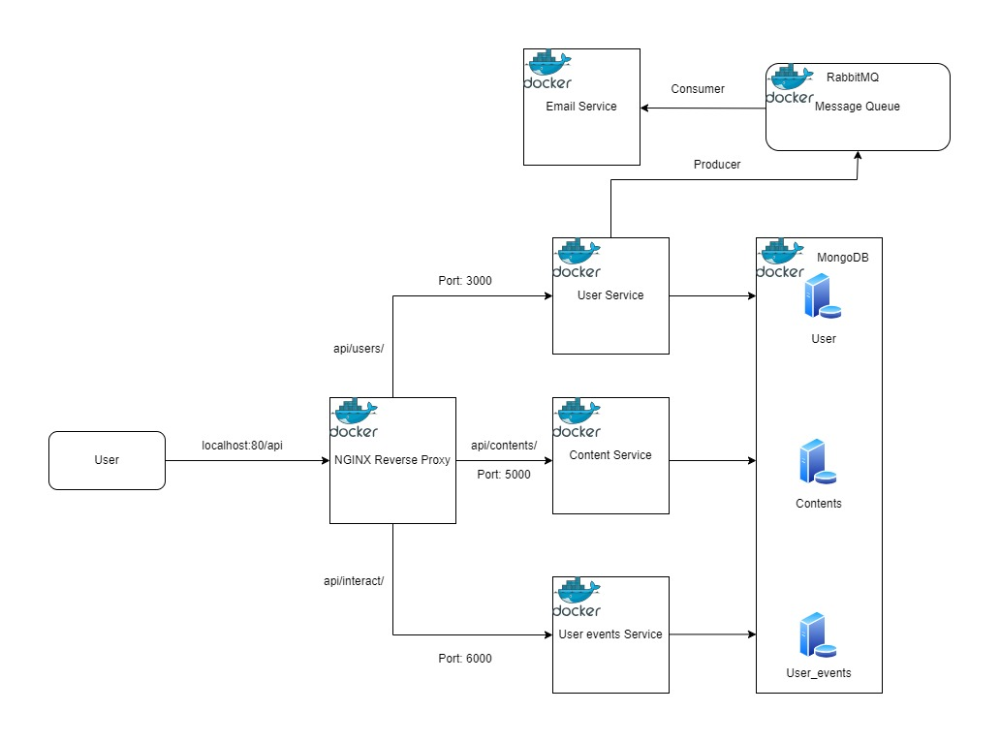

# Book-microservice

This project aims to implement 4 microservices pertaining to serving books as content.

# Instructions
Run the docker compose yaml file to start: `docker-compose -f docker-compose.yaml up`

# System Design

## Features
- Built a scalable backend system to serve books as contents.
- Dockerized entire application including all services and databases for easy deployement.
- Used Nginx as a reverse proxy to cater requests to different services.
- Used RabbitMQ as the Message-Broker to publish message from User Service to Email Service after which an email will be sent to the newly regsitered user.
- User can filter books based on the basis of likes or reads interactions.
- Implemented database using Mongodb for all three services.

## System Architecture



## User Service

- User service deals with user registration and login.
- Jwt tokens is used to authorize the incoming user's request in all the services.

### Rest Apis

     register new user          POST     http:://api/users/register

     Login current user         GET      http:://api/users/login

     update phoneno             PATCH    http:://api/users/updatephone

     update password            PATCH    http:://api/users/updatepassword

     update name                PATCH    http:://api/users/updatename
     
     delete user                DELETE   http:://api/users

- Request
 ```
  curl -X POST -d '{"name":"chirag","email":"chirag@example.com","password":"abc1","phoneno":8123456789}' \
  http://localhost:80/api/users/register \
  --header 'Content-Type: application/json'
 ```
 
- Response Body: 201
 ```json
  {
   "result": {
       "name": "Chirag",
        "email": "chirag@example.com",
        "password": "abc1",
        "phoneno": 8123456789,
        "_id": "61f77e267aceb6f9e51c25b3",
      }        
  }
 ```

 ## Email Service
 - Email service sends greeting mail to the newly registered users.
 - It consumes events from Message queue published by User service after new registration.
 - Email is sent using node mailer.
 

 
## Content Service
- Serving books as content. A content will have a story and title as contents.
- Content service should have atleast the title, story, date published and the user id stored.
- A user will be able to create, update and delete contents.

### Rest Apis

     post new content             POST    http:://api/contents/

     get newly added contents     GET     http:://api/users/new

     get top liked contents       GET     http:://api/contents/top/liked

     get top read contents        GET     http:://api/contents/top/read

     get content by id            GET     http:://api/contents/:id
     
     update story                 PATCH   http:://api/contents/:id/update-story
     
     update title                 PATCH   http:://api/contents/:id/update-title
     
     delete content               DELETE  http:://api/contents/:id
     
 - Request     
  ```
  curl -H "Authorization: Bearer <Token>" http://localhost:80/api/contents/new \
  --header 'Content-Type: application/json'
  ```   
 - Response
  ```json
  "result": 
  {
    [
      {
         "_id": "61f82deddaa122263e6f0c22",
         "title": "Interstellar",
         "story": "No Time for caution",
         "user_id": "61f82b9d2dfca828d5238e2c",
         "createdAt": "2022-01-31T18:43:57.980Z",
      },
      {
         "_id": "61f82ba9daa122263e6f0c1d",
         "title": "HEllo world",
         "story": "Random story",
         "user_id": "61f82b9d2dfca828d5238e2c",
         "createdAt": "2022-01-31T18:34:17.596Z"
      },
      {
         "_id": "61f82ba8daa122263e6f0c1b",
         "title": "Toy story",
         "story": "To infity and beyond",
         "user_id": "61f82b9d2dfca828d5238e2c",
         "createdAt": "2022-01-31T18:34:16.177Z"
      }
    ]
  }
  ```
 ## User interaction service
 - User Interaction service is basically to record events done by the user. In this case the service records 2 types of
   events - Like and Read.
 - Like - The content liked by the current user.
 - Read - The content i.e book completely read by the user.
 - This service exposes API for content service inorder to fetch top contents based on likes and reads count since these 2 events data is 
   stored in User_events database.
     
### Rest Apis
   
     Like a content                          PUT    http:://api/interact/like

     Comepleted reading a content            PUT    http:://api/interact/read

     get like interaction on given content   GET    http:://api/interact/:content_id/likes
     
     get read interaction on given content   GET    http:://api/interact/:content_id/read

   
- Request 
 ```
  curl -X PUT -H "Authorization: Bearer <Token>" http://localhost:80/api/interact/like?content_id=61f82ba9daa122263e6f0c1d \
  --header 'Content-Type: application/json'
 ```
     
- Response
 ```json
 {
    "success": true
 }
 ```